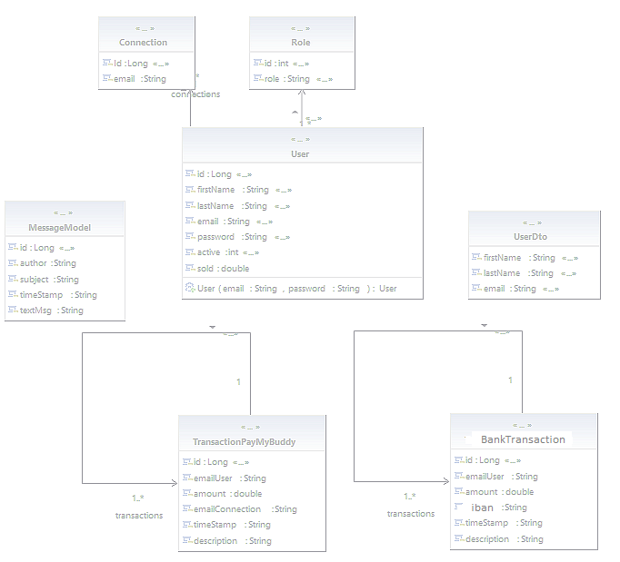

# payMyBuddy
Getting Started

Prerequis
Java 1.8
Maven 3.6.1
Mysql 8.0.19
Installing
Java:
https://docs.oracle.com/javase/8/docs/technotes/guides/install/install_overview.html

Maven:
https://maven.apache.org/install.html

MySql:
https://dev.mysql.com/downloads/mysql/

Initialisation de la base de données :
Nom : payMyBuddy
Id : root
Password : rootroot

Lancement :
Importez le code dans un IDE et exécutez le

Modèle Physique de Données

Diagramme UML

# finalPayMyBuddy
